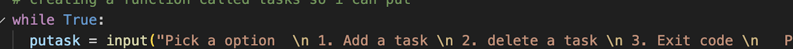

During the past week I started using python and one thing we had to do was create a to do list application in python. 
 Now for the application it was definitely troubling to properly code mainly the part where I had to allow the user to remove the task. So for the first part it was simple. I first just created a function for tasks so that they can be listed. After that I just created a string that will allow the user to pick an option that will either allow them to add or delete a task and exit the code. 
 			

So after I did that part I decided to use conditional statements so that I can add,delete and select certain tasks. Now for the part that can be trouble which was the ability to delete/remove tasks . So in order to do that I had researched on how I can do it and I learned that I can use the int function and used a number -1 in order to remove tasks.
Therefore after that I just used the break function to stip the code from constantly running when it doesn't need to. 
  Finally after all that i just had my code print the list with all the tasks you.
 			
